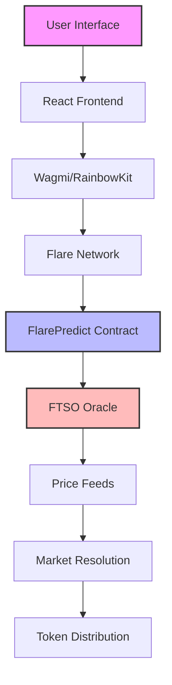

# 🚀 FlarePredict - Real-Time Prediction Markets

<div align="center">


**The Future of Decentralized Prediction Markets is Here** ⚡

*Leveraging Flare's free FTSO oracles for sub-2-second resolution with instant settlement*

[](https://flarepredict.vercel.app)
[](https://dev.flare.network/ftso/)
[](https://discord.gg/flare)

</div>

---

## 🎯 **The Story**

Imagine a world where anyone can predict the future and get rewarded for being right. A world where market wisdom is harnessed through decentralized prediction markets, powered by real-time oracle data. That world is **FlarePredict**.

Born from the vision of democratizing access to prediction markets, FlarePredict leverages Flare Network's revolutionary **FTSO (Flare Time Series Oracle)** to provide instant, accurate, and free price feeds. No more waiting for centralized oracles or paying exorbitant fees. The future of prediction markets is decentralized, fast, and accessible to everyone.

---

## ✨ **Why FlarePredict?**

<div align="center">

| 🚀 **Instant Settlement** | 🔒 **Decentralized** | 💰 **Free Oracles** | ⚡ **Real-Time** |
|---------------------------|----------------------|---------------------|------------------|
| Sub-2-second resolution using FTSO | No single point of failure | FTSO provides free price feeds | Updates every 1.8 seconds |
| Automatic token distribution | Community-driven markets | No oracle fees | Block-latency feeds |
| Smart contract execution | Transparent and verifiable | Built into Flare protocol | Live market data |

</div>

---

## 🛠️ **Tech Stack**

<div align="center">

### **Frontend & UI**


### **Blockchain & Web3**


### **Oracles & Data**


</div>

---

## 🎮 **Features**

### **🎯 Core Functionality**
- **Real-time Prediction Markets**: Create and participate in markets with instant settlement
- **FTSO Integration**: Leverage Flare's free oracle data for accurate price feeds
- **Smart Contract Automation**: Automatic resolution and token distribution
- **Multi-Asset Support**: FLR/USD, BTC/USD, ETH/USD, XRP/USD, and more

### **💎 Advanced Features**
- **Instant Settlement**: Sub-2-second resolution using FTSO block-latency feeds
- **Decentralized Oracle**: No single point of failure, community-driven data
- **Free Price Feeds**: No oracle fees, built into Flare protocol
- **Mobile-First PWA**: Progressive Web App with offline capabilities
- **Real-Time Updates**: Live market data and activity feeds

### **🔧 Developer Experience**
- **TypeScript**: Full type safety across the entire stack
- **Modern React**: Hooks, context, and functional components
- **Smart Contract Testing**: Comprehensive test suite with Hardhat
- **Deployment Ready**: Configured for Vercel and mainnet deployment

---

## 🚀 **Quick Start**

### **Prerequisites**
```bash
# Node.js 18+ and npm/yarn
node --version  # v18.0.0 or higher
npm --version   # 8.0.0 or higher
```

### **Installation**
```bash
# Clone the repository
git clone https://github.com/your-username/FlarePredict.git
cd FlarePredict

# Install dependencies
npm install

# Set up environment variables
cp env.example .env.local
# Edit .env.local with your configuration
```

### **Development**
```bash
# Start development server
npm run dev

# Open http://localhost:3000
```

### **Smart Contract Deployment**
```bash
# Compile contracts
npx hardhat compile

# Deploy to Coston2 testnet
npx hardhat run scripts/deploy.ts --network coston2

# Deploy to Flare mainnet
npx hardhat run scripts/deploy.ts --network flare
```

---

## 📊 **Market Examples**

<div align="center">

| **Category** | **Market Example** | **Resolution** |
|--------------|-------------------|----------------|
| 🏦 **Crypto** | Will FLR reach $0.05 by Dec 31, 2024? | FTSO FLR/USD feed |
| 🏈 **Sports** | Will Team A win the championship? | Manual resolution |
| 🌍 **Politics** | Who will win the next election? | Manual resolution |
| 📈 **Economy** | Will BTC reach $50,000 by Q1 2025? | FTSO BTC/USD feed |
| 🌤️ **Weather** | Will it rain on Christmas Day? | Manual resolution |

</div>

---

## 🔧 **Architecture**

<div align="center">



</div>

### **Smart Contract Features**
- **Market Creation**: Create binary prediction markets with custom thresholds
- **Bet Placement**: Place bets with FLR tokens (0.1 - 1000 FLR range)
- **Automatic Resolution**: Use FTSO oracle data for instant settlement
- **Token Distribution**: Automatic payout calculation and distribution
- **Platform Fees**: 2% fee with 10% creator reward

---

## 🧪 **Testing**

```bash
# Run all tests
npm test

# Run specific test file
npm test test/FlarePredict.test.ts

# Run with coverage
npm run test:coverage

# Verify FTSO integration
npx hardhat run scripts/verify-ftso-official.js --network coston2
```

---

## 📈 **Performance**

<div align="center">

| **Metric** | **Value** | **Status** |
|------------|-----------|------------|
| ⚡ **Resolution Time** | < 2 seconds | ✅ FTSO Block-latency |
| 💰 **Oracle Cost** | Free | ✅ Built into Flare |
| 🔒 **Decentralization** | 100+ Data Providers | ✅ FTSO Network |
| 📊 **Accuracy** | 99%+ | ✅ Statistical Analysis |
| 🚀 **Uptime** | 99.9% | ✅ Flare Network |

</div>

---

## 🌟 **Roadmap**

### **Phase 1: Foundation** ✅
- [x] Smart contract development
- [x] FTSO integration
- [x] Basic UI/UX
- [x] Testnet deployment

### **Phase 2: Enhancement** 🚧
- [ ] Advanced market types (range, multi-outcome)
- [ ] Mobile app development
- [ ] Social features and leaderboards
- [ ] API for third-party integrations

### **Phase 3: Scale** 📋
- [ ] Cross-chain compatibility
- [ ] Institutional features
- [ ] Advanced analytics
- [ ] Governance token

---

## 🤝 **Contributing**

We welcome contributions from the community! Here's how you can help:

1. **Fork** the repository
2. **Create** a feature branch (`git checkout -b feature/amazing-feature`)
3. **Commit** your changes (`git commit -m 'Add amazing feature'`)
4. **Push** to the branch (`git push origin feature/amazing-feature`)
5. **Open** a Pull Request

### **Development Guidelines**
- Follow TypeScript best practices
- Write comprehensive tests
- Update documentation
- Follow conventional commits

---

## 📄 **License**

This project is licensed under the MIT License - see the [LICENSE](LICENSE) file for details.

---

## 🙏 **Acknowledgments**

- **Flare Network** for the revolutionary FTSO oracle system
- **Flare Community** for continuous support and feedback
- **Open Source Contributors** who made this possible

---

<div align="center">

**Built with ❤️ for the Flare ecosystem**

[](https://flare.network)
[](https://dev.flare.network/ftso/)

*The future of prediction markets is decentralized, fast, and accessible to everyone.*

</div>
